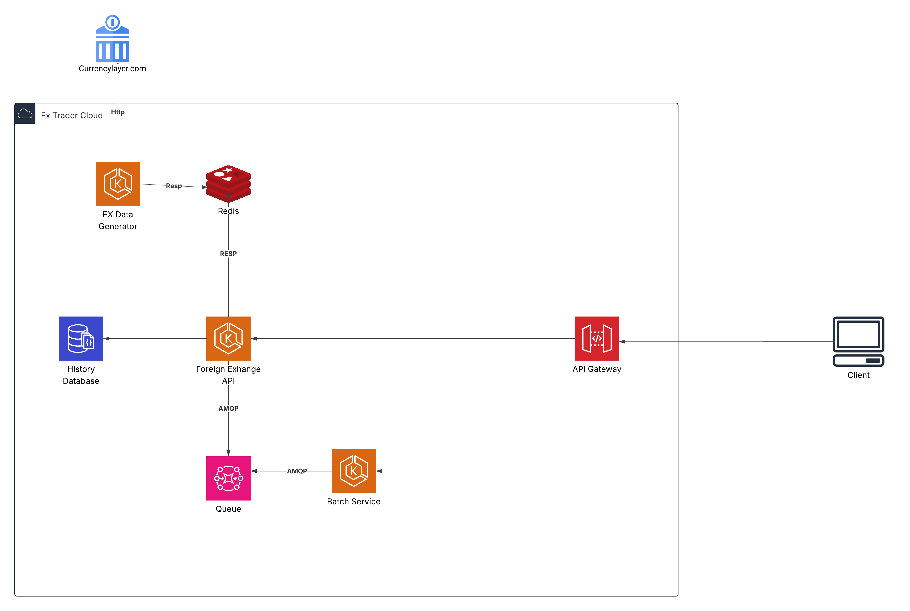

# 💱 Foreign Exchange API

A Spring Boot microservice setup to fetch currency exchange rates from [CurrencyLayer](https://currencylayer.com/), publish them to Redis, and expose them via a reactive REST API backed by MongoDB.

---

## 🚀 Getting Started

### ✅ Prerequisites

Before running the project locally, make sure you have the following installed on your system:

- [**Docker**](https://www.docker.com/products/docker-desktop) (v20+ recommended)  
  Required to build and run all services using Docker Compose.

- [**Git**](https://git-scm.com/)  
  To clone the repository.

### 1. Clone the Repository

```bash
git clone https://github.com/ramazanzor19/exchange.git
cd exchange/dev-services
```

---

### 2. Configure Environment Variables

Create `.env` file in the same directory as `docker-compose.yml`:

```env
# Required - Get your free API key at https://currencylayer.com
CURRENCY_LAYER_API_KEY=YOUR_CURRENCY_LAYER_API_KEY

# Optional - Customize if ports are in use
API_PORT=8080
REDISINSIGHT_PORT=5540
MONGO_EXPRESS_PORT=8081
```

> ⚠️ **Note**: `CURRENCY_LAYER_API_KEY` is mandatory.  
> ⚠️ If `API_PORT` is changed, Swagger/OpenAPI documentation may break due to a static development server definition.

---

### 3. Start the Services

```bash
docker-compose up --build
```

> This builds and launches all services including Redis, MongoDB, API, and UIs. The process may take a few minutes on the first run.

---

## 🧰 Available Services

| Service           | Description                                  | Access URL    |
|------------------|----------------------------------------------|---------------|
| Foreign Exchange API | RESTful API for currency conversion | http://localhost:8080/swagger-ui.html |
| Currency Generator API | Scheduled service that fetches and caches rates | _not exposed_ |
| Redis Insight     | Redis browser UI                             | http://localhost:5540 |
| Mongo Express     | MongoDB browser UI                           | http://localhost:8081 |
| Redis             | 🔒 Private, used internally                  | _not exposed_ |
| MongoDB           | 🔒 Private, used internally                  | _not exposed_ |

> Ports may differ depending on your `.env` configuration.

---

## Architecture

The system consists of several key components working together:

- **Currency Generator**: Fetches exchange rates from the CurrencyLayer API and publishes them to Redis.
- **API Service**: Provides the foreign exchange rates through an HTTP API.
- **MongoDB**: Stores the exchange rate history for auditing and reporting.
- **Redis**: Caches exchange rates for fast access.
- **Mongo Express**: A simple web UI for managing MongoDB data.
- **Redis Insight**: A web UI for managing and monitoring Redis.



## 📚 Documentation

- **Swagger UI**: [http://localhost:8080/swagger-ui.html](http://localhost:8080/swagger-ui.html)
- **OpenAPI Spec**: Defined in `openapi/main.yaml` with static dev server (`http://localhost:8080`). Be aware if you change `API_PORT`.

---

### 📊 UI Tools

- **Mongo Express**  
  http://localhost:8081
    - Username: `admin`
    - Password: `admin`

- **Redis Insight**  
  http://localhost:5540
    - Host: `local-redis`
    - Port: `6379`

---

## 📬 Contributing

Feel free to open issues or submit PRs for improvements.

---

## 📃 License

MIT – See [LICENSE](LICENSE) for more details.
